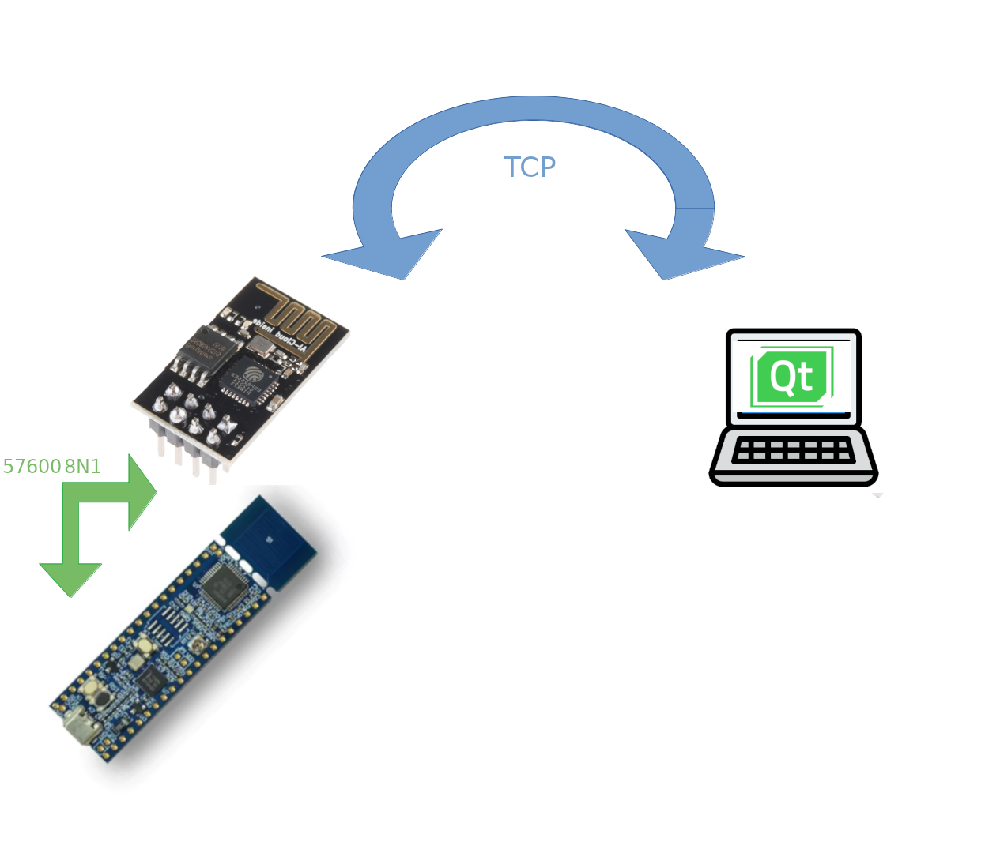

# Demo MQTT Client
## Conexionado:

## Descripción:
	Envío de tramas entre QT y LPC845 vía ESP266 WiFi directo a QTcpServer
	Puerto serverPort = 10234; . Se agrega estado de conexión y actualización de datos al LCD.

